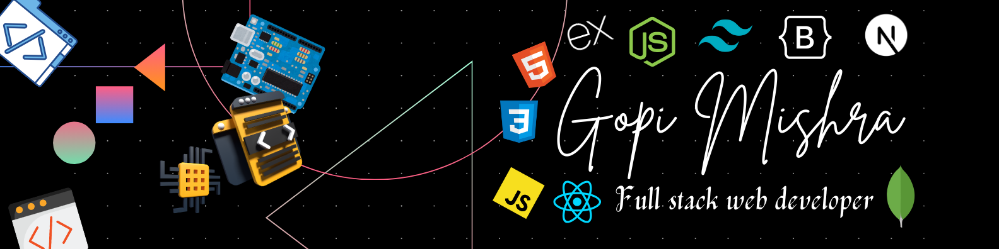

<h2 align="center">Hi , I'm Gopi Mishra</h2>

<h3 align="center">A passionate Full Stack developer from India<h3> 

    <h3 align="center">Profile Visit Count</h3> 
  

> - 🔭 I’m currently working on [E-Commerce Website](https://tinyurl.com/epicgadgetshub)

> - 🌱 I’m currently learning **MERN, Web3**

> - 👨‍💻 All of my projects are available at [My Portfolio Website](https://tinyurl.com/gopimishra)

> - 💬 Ask me about **Web Development & New interesting technologies**

> - 📫 Contact me at **contact.gopimishra@gmail.com**

> - 📄 Know about my experiences [Here](https://linktr.ee/gopimishra71)

> - ⚡ Fun fact **I'm Coder**

 

<h3 align="left">Connect with me:</h3>

<h3 align="left">Languages and Tools: </h3>

  

# 📊 GitHub Stats:

 
 

### ✍️ Random Dev Quote

### 🔝 Top Contributed Repo

<picture>
  <source media="(prefers-color-scheme: dark)" srcset="https://raw.githubusercontent.com/gopimishra71/gopimishra71/output/github-contribution-grid-snake-dark.svg">
  <source media="(prefers-color-scheme: light)" srcset="https://raw.githubusercontent.com/gopimishra71/gopimishra71/output/github-contribution-grid-snake.svg">
  
</picture>
